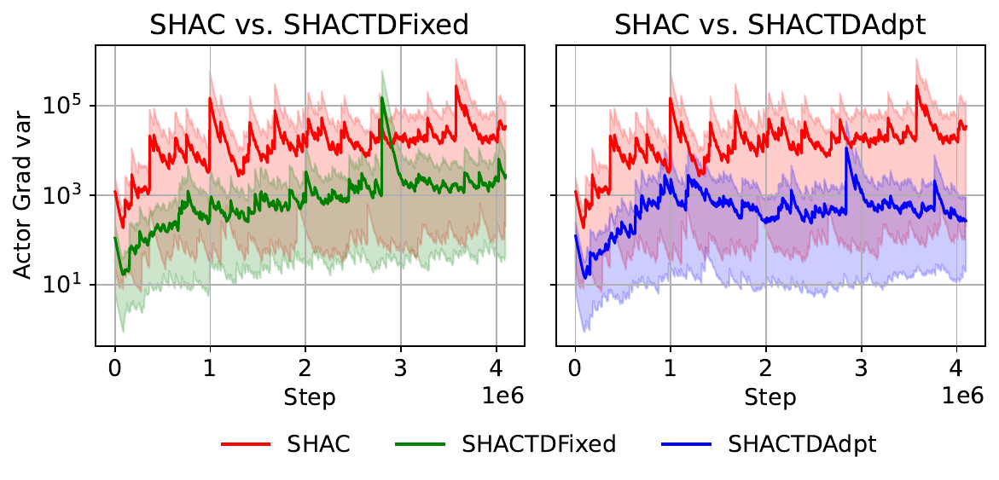
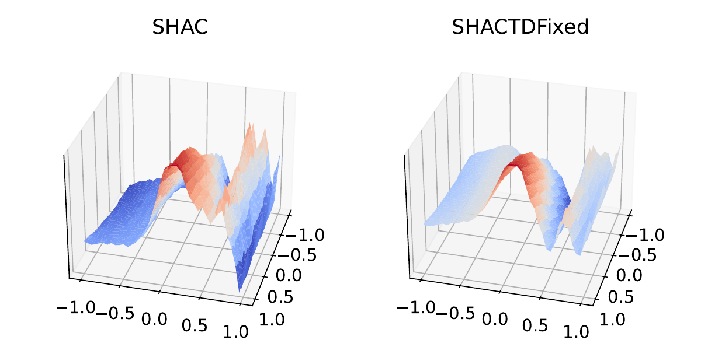

# ARE: Adaptive TD-λ Return Estimation for Learning Control in Differentiable Simulation
🎉🎉🎉 **ACCEPTED AT IJCNN 2026 - BEST STUDENT PAPER NOMINEE** 🎉🎉🎉

Paper: [Read here](media/paper.pdf)

<p align="center">
  
</p>

This is the official repository for the implementation of the paper **ARE: Adaptive TD-λ Return Estimation for Learning Control in Differentiable Simulation**.

In this paper, we propose to control the variance of pathwise gradient in first-order model-based RL algorithms via using the TD-λ return as the maximization objective for the actor network. In addition, we propose to adaptively adjust λ using a value-fitting objective to avoid expensive manual tuning and further enhance the learning stability. 

<table align="center">
  <tbody>
  <tr>
    <td>
     
    </td>
    <td>
      
    </td>
  <tr>
    <td align="center"> Guaranteed variance reduction
    <td align="center"> Smoother optimization landscape
  </tr>
</tbody>
</table>

Our algorithms demonstrate improvements over challenging locomotion tasks, with an average improvement of roughly 50% over the Ant environment and almost 100% with the simulated Unitree Go2 quadruped environment. Moreover, our design allows exploiting the gradient information over a much longer learning horizon, enabling more effective long-term credit assignment for first- order model-based reinforcement learning methods.

<table align="center">
  <tbody>
  <tr>
    <td>
     
    </td>
    <td>
      
    </td>
  <tr>
    <td align="center"> SAPO policy shows less consistent gait (tipping to the sides, bounces) and worse task achievement (moving forward)
    <td align="center"> SAPOTDAdpt policy demonstrates a more natural gait and achieve faster forward speed
  </tr>
</tbody>
</table>

### Acknowledgement
We built our implementation based on
- [mineral 0.0.0](https://github.com/etaoxing/mineral)
- [rewarped 1.3.3](https://github.com/rewarped/rewarped/tree/v1.3.3)

Huge shout out to the author [etaoxing](https://github.com/etaoxing)

### Setup

```bash
conda create -n ARE python=3.10
conda activate ARE

git clone https://github.com/DINHQuangDung1999/ARE.git
cd ARE
pip install -e ./rewarped
pip install -e ./mineral
```

### Train and play policy 

```bash
cd ARE
bash scripts/train.sh
bash scripts/eval.sh
```


