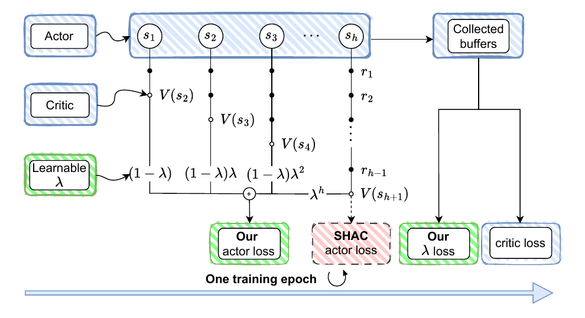

# ARE: Adaptive TD-λ Return Estimation for Learning Control in Differentiable Simulation

This is the official repository for the implementation of the paper **ARE: Adaptive TD-λ Return Estimation for Learning Control in Differentiable Simulation**.

In this paper, we propose to control the variance of pathwise gradient in first-order model-based RL algorithms via using the TD-λ return as the maximization objective for the actor network. In addition, we propose to adaptively adjust λ using a value-fitting objective to avoid expensive manual tuning and further enhance the learning stability. 

Our algorithms demonstrate improvements over challenging locomotion tasks, with an average improvement of roughly 50% over the Ant environment and almost 100% with the simulated Unitree Go2 quadruped environment. Moreover, our design allows exploiting the gradient information over a much longer learning horizon, enabling more effective long-term credit assignment for first- order model-based reinforcement learning methods.



- `mineral` from `etaoxing/mineral`
- `rewarped` from `rewarped/rewarped`

The goal is to keep both codebases in one repository so you can:

- edit both projects together
- keep your run and deployment scripts at the top level
- install both packages from local source
- version your combined modifications in one Git history

## Layout

```text
ARE/
  README.md
  .gitignore
  docs/
    protocols.md
  scripts/
    setup_env.sh
    verify_install.sh
  mineral/
  rewarped/
```

## Development model

This repository treats `mineral/` and `rewarped/` as vendored source trees inside one outer repo. The inner `.git` directories are intentionally absent, so the outer `ARE` repository tracks all source changes directly.

For development, install both packages in editable mode:

```bash
./scripts/setup_env.sh
```

That creates `.venv/` and runs:

```bash
pip install -e ./rewarped
pip install -e ./mineral
```

`rewarped` is installed first because `mineral` can run Rewarped-based tasks.

## Quick start

```bash
cd /home/dung-admin/ws/empty/ARE
./scripts/setup_env.sh
./scripts/verify_install.sh
```

## Importing upstream source

If you want to rebuild the vendored trees from GitHub, use:

```bash
./scripts/import_upstreams.sh
```

That script clones or refreshes:

- `https://github.com/etaoxing/mineral.git`
- `https://github.com/rewarped/rewarped.git`

It then copies their working trees into `ARE/mineral` and `ARE/rewarped` and removes nested `.git` directories so the outer `ARE` repo remains the only Git repository.

Activate the environment when working interactively:

```bash
source .venv/bin/activate
```

## Running

Put your own top-level run scripts in the repository root or in `scripts/`. Example:

```bash
source .venv/bin/activate
python -m mineral.scripts.run --help
```

If you maintain experiment launchers, keep them at the outer level so they can reference both source trees without changing directories.

## Reproducibility

The operating procedure for updating vendored sources, recording provenance, and maintaining deploy scripts lives in [docs/protocols.md](/home/dung-admin/ws/empty/ARE/docs/protocols.md).
